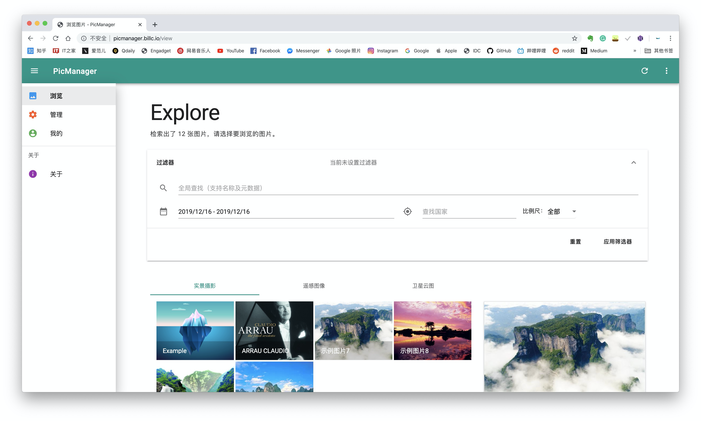
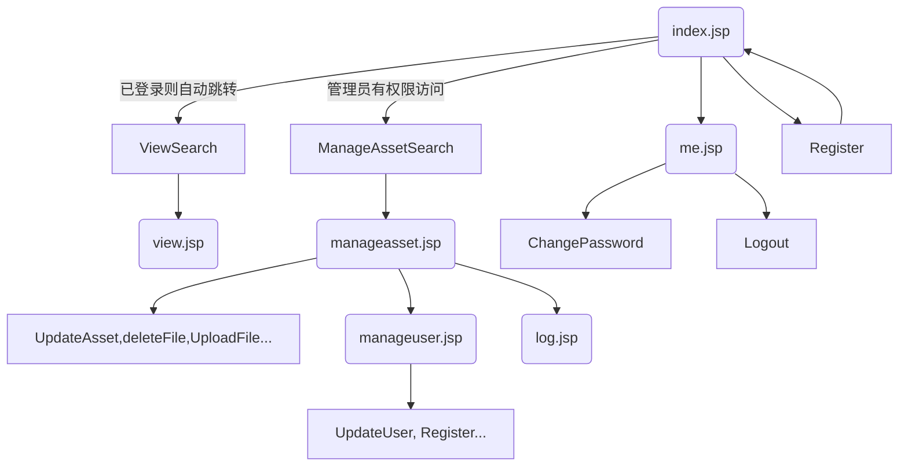
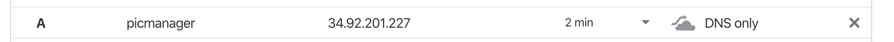
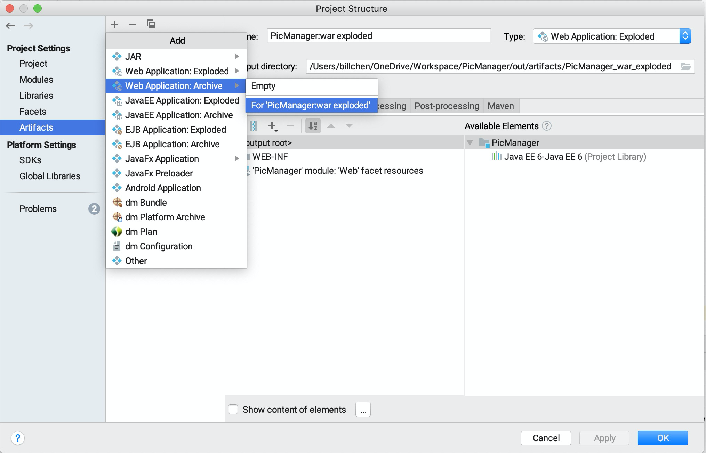
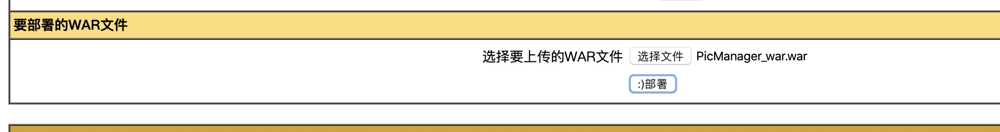
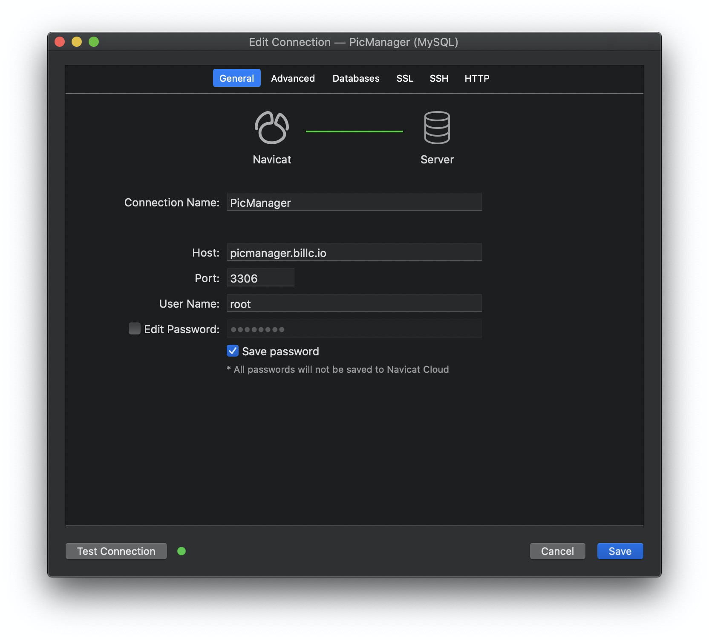
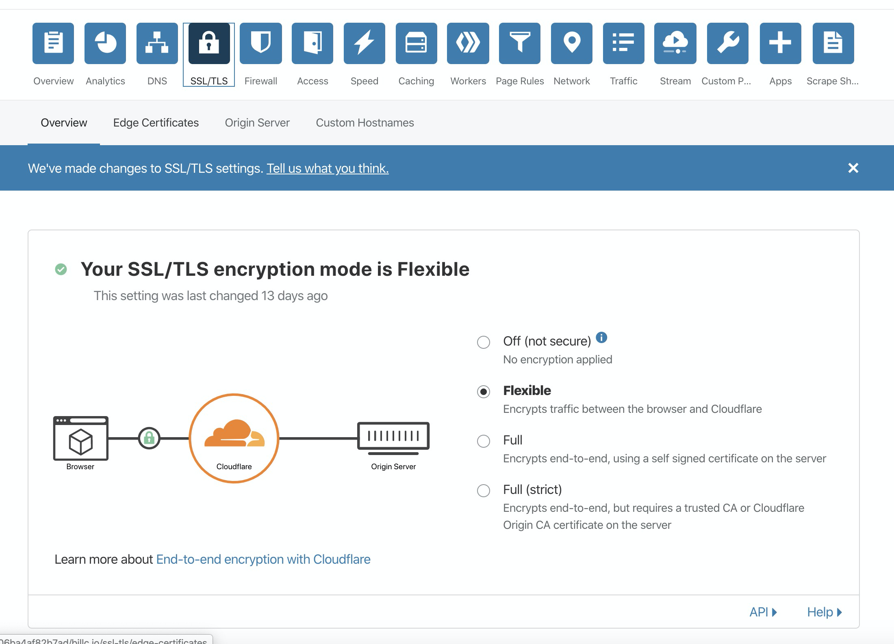

# PicManager

## Intro

一个实现了数据库可视化 & 用户与图片的增删改查的项目。

Based On `J2EE`, `MDUI`,`MySQL`。



## Demo

项目部署地址：http://picmanager.billc.io/

超级管理员账户：root，密码：root

管理员账户：admin，密码：admin

普通用户账户：user，密码：user

新注册的用户默认权限：user。

## 数据库文档

### 连接信息

服务器地址: 34.92.201.227

端口：3306

### 表结构

#### asset

存储资源信息。

| 字段               | 数据类型                         | 含义                                     |
| ------------------ | -------------------------------- | ---------------------------------------- |
| assetid            | int                              | 图片id                                   |
| assetname          | Varchar(100)                     | 名称                                     |
| assettype          | enum('pic','video')              | 类型（图片或视频）                       |
| category           | enum('photograph','gis','cloud') | 图片类型（实景摄影，遥感图像，卫星云图） |
| url                | varchar(300)                     | 图片链接                                 |
| country            | varchar(100)                     | 图片所在国家                             |
| location           | varchar(100)                     | 具体地点                                 |
| latitude           | varchar(20)                      | 经度                                     |
| longitude          | varchar(20)                      | 纬度                                     |
| acq_date           | datetime                         | 获取时间                                 |
| scale              | varchar(100)                     | 比例尺                                   |
| upload_date        | datetime                         | 上传日期                                 |
| last_modified_date | datetime                         | 最后一次修改日期                         |
| uploader_uid       | int(11)                          | 上传者id                                 |

#### user

存储用户信息。

| 字段                  | 数据类型                               | 备注                                 |
| --------------------- | -------------------------------------- | ------------------------------------ |
| uid                   | int(11)(primary key ,  auto_increment) | 用户id                               |
| username              | varchar(100)(unique)                   | 用户名                               |
| password              | varchar(100)                           | 密码（SHA1加密存储）                 |
| password_last_changed | datetime                               | 密码最后一次修改时间                 |
| email                 | varchar(100)                           | 邮箱                                 |
| security_problem      | varchar(1000)                          | 安全问题                             |
| security_answer       | varchar(1000)                          | 安全应答                             |
| registration_date     | datetime                               | 注册时间                             |
| registration_ip       | varchar(255)                           | 注册ip                               |
| role                  | varchar(50)                            | 身份（普通用户，管理员，超级管理员） |

#### log

存储日志信息。

| 字段       | 数据类型                                                     | 备注         |
| ---------- | ------------------------------------------------------------ | ------------ |
| logid      | int(11)(primary key ,auto_increment)                         | 记录操作次数 |
| uid        | varchar(100)                                                 | 操作者id     |
| username   | varchar(255)                                                 | 操作者用户名 |
| assetid    | varchar(100)                                                 | 操作图片id   |
| type       | enum('upload','download','delete','modify','login','logout') | 操作类型     |
| assetname  | varchar(255)                                                 | 操作图片名称 |
| date       | datetime                                                     | 操作时间     |
| request_ip | varchar(255)                                                 | 请求ip       |
| notes      | varchar(1000)                                                | 注释         |

## 前端文档

### 跳转逻辑

左侧导航栏可以在 view, manageasset.jsp, me.jsp 之间互相跳转。



### 权限控制

在本网站中，不同的用户角色具有不同在站点具有权限，详细介绍如下：

|                  | 未登录 | 普通用户(user) | 管理员(admin) | 超级管理员(root) |
| ---------------- | ------ | -------------- | ------------- | ---------------- |
| 注册新账号       | √      | √              | √             | √                |
| 查阅图片         | x      | √              | √             | √                |
| 下载图片         | x      | √              | √             | √                |
| 查看日志         | x      | √              | √             | √                |
| 管理图片         | x      | x              | √             | √                |
| 提升用户为 admin | x      | x              | √             | √                |
| 提升用户为 root  | x      | x              | x             | √                |
| 管理 user        | x      | x              | √             | √                |
| 修改 admin 密码  | x      | x              | √             | √                |
| 修改 root 密码   | x      | x              | x             | √                |

*管理图片 = 图片的增删改查。

*管理用户 = 修改用户名、密码、删除用户的权限。

### 页面简介

#### /index.jsp

主页。该页面具有动态背景，具有注册用户和登录用户功能，分别封装在两个对话框内。

在界面加载时会读取 request 中 的 stat 参数选择是否弹出提示：

| stat 值              | initMessage          |
| -------------------- | -------------------- |
| not_logined          | 请先登录或注册账号   |
| logged_out           | 已登出               |
| wrong_password       | 登录失败：密码错误   |
| user_not_found       | 登录失败：用户不存在 |
| registration_success | 注册成功             |
| already_exist        | 用户名已存在         |
| *null*               | 无                   |

该页面会读取浏览器中的 cookie，如果读取到了 `identifier` 和 `password` 将会自动将信息提交给 `Login` 类。

Cookie 的有效期为 3 天。

#### /view.jsp

查看图片的界面。具有筛选器功能，在筛选后提交表单。具有图片下载、图片元数据浏览、放大浏览等功能。

该页面作为展示层，无法直接访问。需要通过后端的 `ViewSearch` 类提供数据，再跳转到本页面。

如果在 session 中找不到`logined_uid` 参数，则说明用户未登录，会自动跳转到 `index.jsp`。

在页面加载完成后，会读取 session 中的若干参数是否为 null 决定是否弹出消息提示。具有以下参数：

| session 中的参数 | 值       | initMessage        |
| ---------------- | -------- | ------------------ |
| edit_stat        | success  | 编辑成功           |
| edit_stat        | *String* | 编辑失败：*String* |
| upload_stat      | success  | 登陆成功           |
| upload_stat      | *String* | 上传失败：*String* |
| delete_stat      | Success  | 删除成功           |
| delete_stat      | *String* | 删除失败：*String* |

#### /manageasset.jsp

管理图片的界面。该界面只有当用户权限为 role 或 admin 时才可访问。如果用户不具有相应权限，将会被跳转至浏览界面。

该页面作为展示层，无法直接访问。需要通过后端的 `ManageAssetSearch` 类提供数据，再跳转到本页面。

如果在 session 中找不到 `logined_uid` 参数，则说明用户未登录，会自动跳转到 `index.jsp`。

如果用户权限不足，会跳转到 `view.jsp`。

在页面加载完成后，会读取 session 中的若干参数是否为 null 决定是否弹出消息提示。具有以下参数：

| 参数                | initMessage              |
| ------------------- | ------------------------ |
| to_notify_success   | 登陆成功                 |
| to_notify_no_access | 您没有权限管理图片和用户 |

#### /manageuser.jsp

管理用户的界面。该界面只有当用户权限为 role 或 admin 时才可访问。

如果在 session 中找不到 `logined_uid` 参数，则说明用户未登录，会自动跳转到 `index.jsp`。

如果用户权限不足，会跳转到 `view.jsp`。

在页面加载完成后，会读取 session 中的若干参数是否为 null 决定是否弹出消息提示。具有以下参数：

| update_user_stat 值 | initMessage |
| ------------------- | ----------- |
| success             | 更新成功    |
| fail                | 已登出      |
| *String*            | *String*    |

#### /log.jsp

查看日志。对于 root/admin 权限的用户可以看到管理图片和管理用户的跳转接口。

如果在 session 中找不到 `logined_uid` 参数，则说明用户未登录，会自动跳转到 `index.jsp`。

日志具有登录、删除、上传、更新四种类型，每一种日志都会在这里显示。支持显示最近 1000 条日志，按照日期从新到旧排序。

#### /me.jsp

个人信息界面，具有动态背景。会展示用户的用户名、UID 和注册时间。

如果在 session 中找不到 `logined_uid` 参数，则说明用户未登录，会自动跳转到 `index.jsp`。

提供修改自己账户的密码和登出功能。

#### /about.jsp

封装了一个「关于」对话框`#dialog-about`，便于一次修改在所有界面更新关于对话框的内容。

## 后端文档

### 类文档

####  utils.Config

全局配置类。在这个类中存储了系统运行的常见变量。

变量：

| 变量名           | 数据类型 | 备注                               |
| ---------------- | -------- | ---------------------------------- |
| THEME_PRIMARY    | String   | 全局主题色，可以使用 MDUI 中的主题 |
| THEME_ACCENT     | String   | 全局强调色，可以使用 MDUI 中的主题 |
| MYSQL_URL        | String   | 数据库 url，以JDBC格式存储         |
| MYSQL_USER       | String   | 数据库用户名                       |
| MYSQL_PASS       | String   | 数据库密码                         |
| UPLOAD_DIRECTORY | String   | 上传文件的储存目录                 |
| MEMORY_THRESHOLD | int      | 上传文件时的最大内存               |
| MAX_REQUEST_SIZE | int      | 上传文件时的最大请求大小           |
| MAX_FILE_SIZE    | int      | 上传文件时的最大文件大小           |

方法：无

#### utils.DatabaseManager

数据库连接类。任何需要对数据库进行都可以通过本类取得数据库连接并且可以方便地执行查询和更新语句。

已经包含了错误处理。

变量 ：

| 变量名      | 数据类型   | 备注                |
| ----------- | ---------- | ------------------- |
| JDBC_DRIVER | String     | mysql驱动           |
| conn        | Connection | 数据库连接          |
| stat        | Statement  | 用于执行简单sql语句 |
| rs          | ResultSet  | 返回结果类          |

方法：

| 方法名          | 域     | 输入值 | 返回值     | 备注                                                         |
| --------------- | ------ | ------ | ---------- | ------------------------------------------------------------ |
| DatabaseManager | Public | 无     | 无         | 加载数据库驱动                                               |
| getConnection   | Public | 无     | Connection | 取得数据库连接，如果成功返回 Connection 连接，失败则打印错误信息并返回 null。 |
| executeQuery    | Public | String | ResultSet  | 执行查询指令。如果成功返回结果集，失败则打印错误信息并返回 null。 |
| executeUpdate   | Public | String | int        | 执行更新指令。如果成功则执行影响的行数，失败则打印错误信息并返回 -1。 |
| close           | Public | 无     | void       | 关闭数据库连接                                               |

#### utils.Encrypt

加密类

变量： 无 

方法 ：

| 方法名 | 域     | 输入值 | 返回值 | 备注                               |
| ------ | ------ | ------ | ------ | ---------------------------------- |
| SHA1   | Public | String | String | 使用 SHA1 加密，返回密码加密后结果 |


#### utils.Utils

实用工具类。

变量：无

| 方法名             | 域     | 输入值                     | 返回值 | 备注                                                         |
| ------------------ | ------ | -------------------------- | ------ | ------------------------------------------------------------ |
| getRealRemoteIP    | Public | HttpServletRequest request | String | 取得 request 中的真实 IP。用于处理通过 localhost 访问网站时的日志异常。 |
| getCurrentDateTime | Public | 无                         | String | 获取 MySQL 数据库格式存储当前时间                            |
| parseAsset         | Public | ResultSet                  | Asset  | 通过数据库查询的返回结果整合信息，将获得信息形成 bean类里Asset 的对象 |
| parseUser          | Public | ResultSet                  | User   | 用所获得信息形成 bean类里User 的对象                         |

#### bean.Asset

资源的 Java Bean，用于沟通数据库和后端。

具有以下字段的 Setter 和 Getter:

| Variation          | Type    | Default Value |
| ------------------ | ------- | ------------- |
| id                 | int     | -1            |
| name               | String  | N/A           |
| type               | String  | N/A           |
| category           | String  | N/A           |
| url                | String  | N/A           |
| acq_date           | String  | N/A           |
| upload_time        | Stringn | N/A           |
| uploader_uid       | int     | -1            |
| last_modified_date | String  | N/A           |
| scale              | String  | N/A           |
| country            | String  | N/A           |
| location           | String  | N/A           |
| latitude           | String  | N/A           |
| longitude          | String  | N/A           |

#### bean.User

用户的 Java Bean，用户沟通数据库和后端。

具有以下字段的 Setter 和 Getter：

| 字段                  | 数据类型 | 缺省值 |
| --------------------- | -------- | ------ |
| uid                   | int      | -1     |
| username              | String   | N/A    |
| password              | String   | N/A    |
| email                 | String   | N/A    |
| registration_date     | String   | N/A    |
| registration_ip       | String   | N/A    |
| role                  | String   | user   |
| password_last_changed | String   | N/A    |

### Servlet 文档

#### Login

登录用户。

方法： Post / Get

URL： /login

先判断是否 session 中已记录信息，如有则直接登录，否则需用户名密码登录

| 参数       | 合法值   | 备注                             |
| ---------- | -------- | -------------------------------- |
| identifier | *String* | 用户的标识符，可以是用户名或密码 |
| password   | *String* | 验证密码                         |
| AutoLogin  | String   | 是否通过 cookie 记住的密码登录   |

密码正确则跳转到浏览界面，如密码错误在 session 中设置 Attribute, 将 `stat` 设置成 `wrong_password`。

登录成功后将会在 session 中记录 `logined_uid`、``logined_username`、`logined_user_role` 三个参数供其他页面访问。

#### Logout

登出用户。

方法： Post / Get

URL： /logout

参数：无。

#### ManageAssetSearch

实现管理页面的筛选功能，为 `manage.jsp`提供数据。将会将所有查询到的数据放置到 `HashMap <Interget, Asset> assetMap`内通过 `request.setAttribute`传递给前端。

方法：Post

URL:  /manageassetsearch

在处理请求之前，通过判断session 中的参数`logined_uid` 是否为空来判断用户是否登录，如果没有登录则跳转到 `index.jsp`。

用 session 中的参数`logined_user_role` 判断身份，如非管理员则显示无权限进行管理。在前端不会显示管理界面，即使通过地址栏访问也会跳转到 `view`。

（则不存在上传，更改，删除操作）

| 参数          | 合法值   | 备注           |
| ------------- | -------- | -------------- |
| searchName    | *String* | 所筛选图片名字 |
| searchCountry | *String* | 所筛选国家     |
| searchScale   | *String* | 所筛选比例尺   |

完成搜索后将所搜索到的所有数据放入 assetMap 内，通过 request.setAttribute 传递数据，跳转至 manageasset.jsp。

#### ChangePassword

用于由用户主动修改自己的密码。管理员修改密码使用的 Servelt 是 `UpdateUser`。

方法：Post 

URL: /changepassword

在处理请求之前，通过判断session 中的参数`logined_uid` 是否为空来判断用户是否登录，如果没有登录则跳转到 `index.jsp`。

用 session 中的参数`logined_user_role` 判断身份，如非管理员则显示无权限进行管理。在前端不会显示管理界面，即使通过地址栏访问也会跳转到 `view`。

| 参数        | 合法值   | 备注                 |
| ----------- | -------- | -------------------- |
| oldPassword | *String* | 原密码，用于验证身份 |
| newPassword | *String* | 新密码               |

更新后在session 中设置 Attribute，将 stat 设置成change_success 或 wrong_old_password。

#### DeleteFile

用于删除已上传的图片。

方法：Post

URL: /deletefile

在处理请求之前，通过判断session 中的参数`logined_uid` 是否为空来判断用户是否登录，如果没有登录则跳转到 `index.jsp`。

用 session 中的参数`logined_user_role` 判断身份，如非管理员则显示无权限进行管理。在前端不会显示管理界面，即使通过地址栏访问也会跳转到 `view`。

| 参数 | 合法值   | 备注         |
| ---- | -------- | ------------ |
| aid  | *String* | 所删除图片id |

删除后在session 中设置 Attribute, 将delete_stat 设置为 success 或 fail。

#### DownloadFile

用于下载已上传图片。主要的作用为记录日志，文件下载本身应当由发出请求的前端页面实现。

方法：Post / Get

URL: /downloadfile

在处理请求之前，通过判断session 中的参数`logined_uid` 是否为空来判断用户是否登录，如果没有登录则跳转到 `index.jsp`。

| 参数      | 合法值   | 备注         |
| --------- | -------- | ------------ |
| aid       | *String* | 下载图片id   |
| assetname | *String* | 下载图片名称 |

#### Register

用于注册用户。管理员注册和用户自行注册都使用的本类。

方法：Post

URL： /register

可在注册页面注册或在管理页面手动创建。

| 参数     | 合法值   | 备注                    |
| -------- | -------- | ----------------------- |
| name     | *String* | 用户名,判断是否已经存在 |
| password | *String* | 密码                    |
| email    | *String* | 邮箱                    |
| date     | *String* | 注册时间                |
| ip       | *String* | 注册ip                  |

注册界面：

如用户名未冲突将 `session`中设置 `Attribute`，将 `stat` 设为``registration_success`

如用户名已存在将 `session`中设置 `Attribute`，将 `stat` 设为``already_exist`。
而后跳转至登录界面

管理界面：

如用户名未冲突将session中设置 Attribute，将 update_user_stat 设为 添加成功 

如用户名已存在将session中设置 Attribute，将 update_user_stat 设为 无法添加：用户名已存在 。
跳转回管理界面

#### UpdateAsset

用于更新图片信息。

方法：Post

URL：/updateasset

在处理请求之前，通过判断session 中的参数`logined_uid` 是否为空来判断用户是否登录，如果没有登录则跳转到 `index.jsp`。

用 session 中的参数`logined_user_role` 判断身份，如非管理员则显示无权限进行管理。在前端不会显示管理界面，即使通过地址栏访问也会跳转到 `view`。

| 参数      | 合法值   | 备注     |
| --------- | -------- | -------- |
| aid       | *Int*    | 图片id   |
| name      | *String* | 图片名称 |
| country   | *String* | 国家     |
| location  | *String* | 具体位置 |
| latitude  | *String* | 经度     |
| longitude | *String* | 纬度     |

更新后在 session 中设置 Attribute, 将 edit_stat 设置成 success 或 编辑失败的信息。

#### UpdateUser

用于更新用户信息。

方法：Post

URL：/updateuser

在处理请求之前，通过判断session 中的参数`logined_uid` 是否为空来判断用户是否登录，如果没有登录则跳转到 `index.jsp`。

用 session 中的参数`logined_user_role` 判断身份，如非管理员则显示无权限进行管理。在前端不会显示管理界面，即使通过地址栏访问也会跳转到 `view`。

| 参数        | 合法值                                      | 备注                            |
| ----------- | ------------------------------------------- | ------------------------------- |
| uid         | *Integer*                                   | 要操作的用户 ID                 |
| type        | {delete, setPassword, setUsername, setRole} | 指定修改的类型                  |
| newPassword | *String*                                    | 当type为setPassword时的新密码   |
| newUsername | *String*                                    | 当type为setUsername时的新用户名 |
| newRole     | {user, admin}                               | 当type为setRole时的新角色       |


更新后在 session 中设置 Attribute, 将 user_update_stat 设置成 success 或 fail。

#### UploadFile

用于上传图片

方法：Post, enctype="multipart/form-data"

URL：/uploadfile

在处理请求之前，通过判断session 中的参数`logined_uid` 是否为空来判断用户是否登录，如果没有登录则跳转到 `index.jsp`。

用 session 中的参数`logined_user_role` 判断身份，如非管理员则显示无权限进行管理。在前端不会显示管理界面，即使通过地址栏访问也会跳转到 `view`。

| 参数            | 合法值                 | 备注         |
| --------------- | ---------------------- | ------------ |
| uploadName      | *String*               | 上传图片名称 |
| uploadCategory  | {photograph,gis,cloud} | 上传图片类型 |
| uploadCountry   | *String*               | 所在国家     |
| uploadLocation  | *String*               | 具体位置     |
| uploadLatitude  | *String*               | 经度         |
| uploadLongitude | *String*               | 纬度         |
| uploadScale     | *String*               | 比例尺       |

上传后在 session 中设置 Attribute，根据结果将 upload_stat 设置成 success 或 fail。

#### ViewSearch

提供筛选功能，沟通数据库，为 view.jsp 提供供显示的数据。将会将所有查询到的数据放置到 `HashMap <Interget, Asset> assetMap`内通过 `request.setAttribute`传递给前端。

| 参数          | 合法值   | 备注           |
| ------------- | -------- | -------------- |
| searchName    | *String* | 所筛选图片名字 |
| searchCountry | *String* | 所筛选国家     |
| searchScale   | *String* | 所筛选比例尺   |

## 部署报告

###  服务器配置

#### 购买服务器

登录 Google 账号，前往`Google Cloud Platform`，进入 Computer Engine 的 VM 实例页面：


点击创建实例，设置服务器的配置。在本次部署中我使用了 `Ubuntu 18.04 LTS`，配置采用了基础的`g1-small 1 vCPU, 1.7 GB Memory`。同时为了能够浏览网页，需要在下方勾选允许 HTTP 和 HTTPS 流量。


新建服务器后，前往 VPC 网络界面配置防火墙规则，允许 443、80、3306 端口的上下行流量，用于访问 HTTP 和 HTTPS 服务和 MySQL 数据库。为了方便，可以临时允许所有端口的出入站流量。


为了允许使用密码认证的 ssh 远程登录方便在本地计算机上部署，需要先使用 Google 提供的在线 SSH 连接页面，服务器上使用 `vim /etc/ssh/sshd_config` 编辑 sshd 的配置文件。配置`PermitPasswordAuthenticatioin yes`和 `AllowRootLogin yes`，然后使用`sudo passwd`设置root用户的密码。

配置完成后，使用`service sshd restart`	重启 sshd， 即可在远程登录服务器：


#### 环境配置

安装常用工具：

```bash
apt install wget
apt install tar
```

安装 MySQL：

```bash
mkdir Download
wget https://dev.mysql.com/get/mysql-apt-config_0.8.14-1_all.deb
dpkg -i mysql-apt-config_0.8.14-1_all.deb
apt update
sudo apt install mysql-server
```

安装的时候填写用户和密码后，登录 MySQL，使用命令`CREATE DATABESE picmanage;`创建项目所需的数据库。

安装 Tomcat：

```bash
wget http://mirrors.tuna.tsinghua.edu.cn/apache/tomcat/tomcat-9/v9.0.29/bin/apache-tomcat-9.0.29.tar.gz
tar -xf apache-tomcat-9.0.29.tar.gz
mv apache-tomcat-9.0.29 /usr/local/bin/tomcat
```

为了使 Tomcat 的图形化管理界面能够从外网访问便于上传代码，需要修改 Tomcat 的配置文件：

在 conf/tomcat-users.xml 中增加配置：

```xml
<role rolename="admin-gui"/>
<role rolename="manager-gui"/>
<role rolename="manager-jmx"/>
<role rolename="manager-script"/>
<role rolename="manager-status"/>
<user username="tomcat" password="123456" roles="admin-gui,manager-gui,manager-jmx,
manager-script,manager-status"/>
```

在 webapps/manager/META-INF/context.xml 中修改地址访问限制：

```xml
<Context antiResourceLocking="false" privileged="true" >
  <Valve className="org.apache.catalina.valves.RemoteAddrValve"
         allow="^.*$" />
</Context>
```

前往 bin，重新启动 Tomcat：

```bash
./shutdown.sh
./startup.sh
```

此后可以在地址栏中访问 /manager 图形化管理站点。

安装 JRE、JDK：

```bash
apt install openjdk-11-jre-headless
apt install openjdk-11-jdk-headless
```

安装后输入命令 `java --version` 检查安装版本，得到以下反馈：


安装成功。

#### 解析域名

前往 CloudFlare 的控制面板，在 DNS 选项卡下添加一条 A 类型的记录，记录指向的 ip 地址为服务器 ip，并将 ip 解析到 picmanager.bllc.io。



### 生成 war 包

配置好项目的配置文件，将数据库的地址改为远程服务器的地址。

在 IntelliJ IDEA 的 Project Structure 中的 Project Structure 中新建 Artifacts，类型设置为 Archive，并设置任意导出目录。



在 Build 菜单中选择 Buii l d Artifacts，选择刚刚新建的 Artifact，生成 war 包。


### 上传部署

#### 部署项目文件

在浏览器地址输入 picmanager.billc.io/manager/html 进入 Tomcat 的后台管理界面，输入用户名和密码，点击部署按钮上传刚刚生成的 war 包：



上传完成后，为了便于访问，将 PicManager_war 包设置为根目录。

修改 conf/server.xml，添加以下内容：

```xml
<Context path="/" docBase="webapps/PicManager_war" debug="true" reloadable="false"></Context>
```

随后 PicManager 将会成为 Tomcat 的根目录访问的项目。

#### 部署数据库

使用 Navicat 远程连接数据库：



连接数据库后将 localhost 的数据库结构和数据文件导出为 SQL 文件，再导入到服务器：


导入完成后即可远程访问访问数据库。

#### 开启 SSL

进入 CloudFlare 的控制面板，启用该 A 类型记录的 Proxied 选项。

 


然后进入 SSL/TLS 选项卡，将 SSL/TLS encryption mode 设置为 Flexible。这样即使不在服务器上配置 SSL 证书，也可使用 Cloudflare 生成的弹性证书在用户浏览器和 Cloudflare 代理服务器之间增加代理证书。



最后在浏览器中输入地址 https://picmanager.billc.io，已经可以正常访问项目。


> Bill Chen & ZXP
>
> 2019.12.16