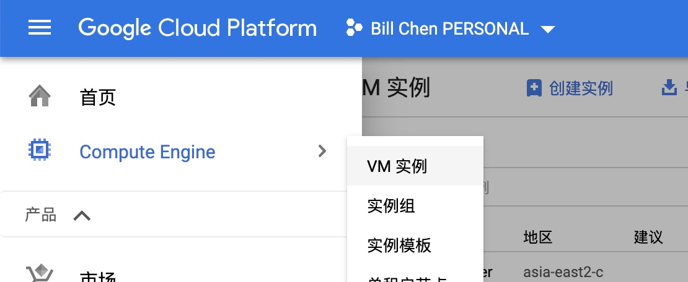
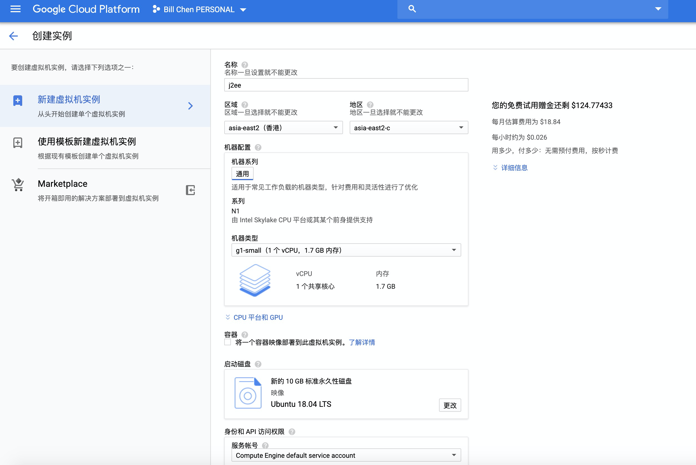
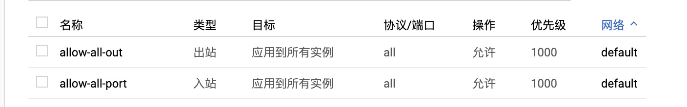
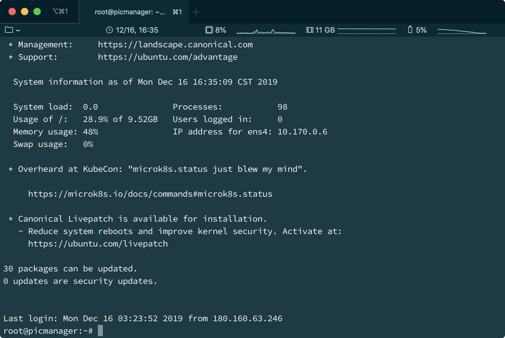
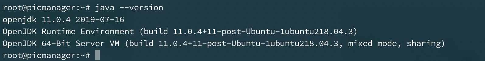
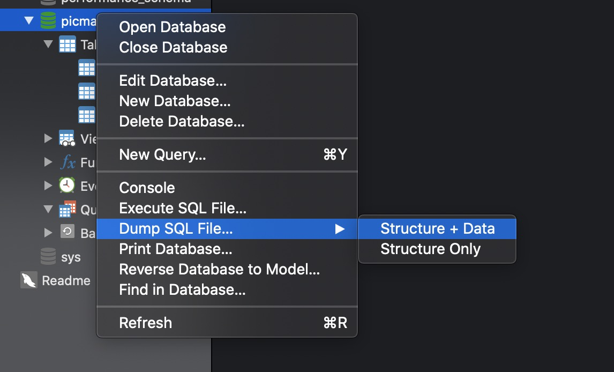

# PicManager (J2EE 项目) 部署报告

##  服务器配置

### 购买服务器

登录 Google 账号，前往 Google Cloud Platform，进入 Computer Engine 的 VM 实例页面：



点击创建实例，设置服务器的配置。同时为了能够浏览网页，需要在下方勾选允许 HTTP 和 HTTPS 流量。



新建服务器后，前往 VPC 网络界面配置防火墙规则，允许 443、80、3306 端口的上下行流量，用于访问 HTTP 和 HTTPS 服务和 MySQL 数据库。为了方便，可以临时允许所有端口的出入站流量。



为了允许使用密码认证的 ssh 远程登录方便在本地计算机上部署，需要在服务器上使用 `vim /etc/ssh/sshd_config` 编辑 sshd 的配置文件。配置`PermitPasswordAuthenticatioin yes`和 `AllowRootLogin yes`，然后使用`sudo passwd`设置root用户的密码

配置完成后，使用`service sshd restart`	重启 sshd， 即可在远程登录服务器：



### 环境配置

安装常用工具：

```bash
apt install wget
apt install tar
```

安装 MySQL：

```bash
mkdir Download
wget https://dev.mysql.com/get/mysql-apt-config_0.8.14-1_all.deb
dpkg -i mysql-apt-config_0.8.14-1_all.deb
apt update
sudo apt install mysql-server
```
安装的时候填写用户和密码后，登录 MySQL，使用命令`CREATE DATABESE picmanage;`创建项目所需的数据库。

安装 Tomcat：

```bash
wget http://mirrors.tuna.tsinghua.edu.cn/apache/tomcat/tomcat-9/v9.0.29/bin/apache-tomcat-9.0.29.tar.gz
tar -xf apache-tomcat-9.0.29.tar.gz
mv apache-tomcat-9.0.29 /usr/local/bin/tomcat
```
为了使 Tomcat 的图形化管理界面能够从外网访问便于上传代码，需要修改 Tomcat 的配置文件：

在 conf/tomcat-users.xml 中增加配置：

```xml
<role rolename="admin-gui"/>
<role rolename="manager-gui"/>
<role rolename="manager-jmx"/>
<role rolename="manager-script"/>
<role rolename="manager-status"/>
<user username="admin" password="123456" roles="admin-gui,manager-gui,manager-jmx,
manager-script,manager-status"/>
```

在 webapps/manager/META-INF/context.xml 中修改地址访问限制：

```xml
<Context antiResourceLocking="false" privileged="true" >
  <Valve className="org.apache.catalina.valves.RemoteAddrValve"
         allow="^.*$" />
</Context>
```

此后可以在地址栏中访问 /manager 图形化管理站点。

安装 JRE、JDK：

```bash
apt install openjdk-11-jre-headless
apt install openjdk-11-jdk-headless
```

安装后输入命令 `java --version` 检查安装版本，得到以下反馈：



安装成功。

### 解析域名

前往 CloudFlare 的控制面板，在 DNS 选项卡下添加一条 A 类型的记录，记录指向的 ip 地址为服务器 ip，并将 ip 解析到 picmanager.bllc.io。


## 生成 war 包

配置好项目的配置文件，将数据库的地址改为远程服务器的地址。

在 IntelliJ IDEA 的 Project Structure 中的 Project Structure 中新建 Artifacts，类型设置为 Archive，并设置任意导出目录。


在 Build 菜单中选择 Buii l d Artifacts，选择刚刚新建的 Artifact，生成 war 包。


## 上传部署

### 部署项目文件

在浏览器地址输入 picmanager.billc.io/manager/html 进入 Tomcat 的后台管理界面，点击部署按钮上传刚刚生成的 war 包：


上传完成后，为了便于访问，将 PicManager_war 包设置为根目录。

修改 conf/server.xml，添加以下内容：

```xml
<Context path="/" docBase="webapps/PicManager_war" debug="true" reloadable="false"></Context>
```

随后 PicManager 将会成为 Tomcat 的根目录访问的项目。

### 部署数据库

使用 Navicat 远程连接数据库：


连接数据库后将 localhost 的数据库结构和数据文件导出为 SQL 文件，再导入到服务器：



导入完成后即可远程访问访问数据库。

### 开启 SSL

进入 CloudFlare 的控制面板，启用该 A 类型记录的 Proxied 选项。

 


然后进入 SSL/TLS 选项卡，将 SSL/TLS encryption mode 设置为 Flexible。这样即使不在服务器上配置 SSL 证书，也可使用 Cloudflare 生成的弹性证书在用户浏览器和 Cloudflare 代理服务器之间增加代理证书。


最后在浏览器中输入地址 https://picmanager.billc.io，已经可以正常访问项目。

> Bill Chen
>
> 2019.12.16