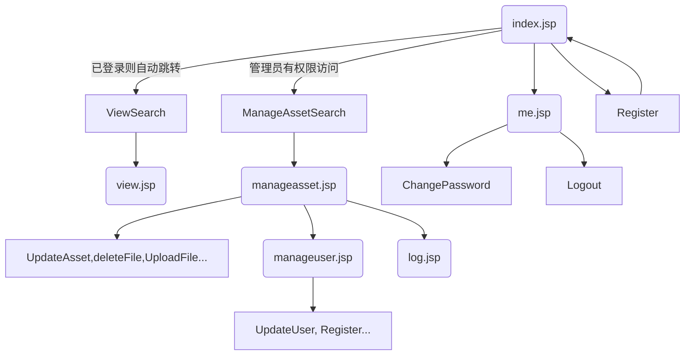

# PicManager (J2EE 项目) 前端文档

## 跳转逻辑

左侧导航栏可以在 view, manageasset.jsp, me.jsp 之间互相跳转。

## 页面简介

### /index.jsp。

主页。该页面具有动态背景，具有注册用户和登录用户功能，分别封装在两个对话框内。

在界面加载时会读取 request 中 的 stat 参数选择是否弹出提示：

stat 值 | initMessage
---|---
not_logined | 请先登录或注册账号
logged_out|已登出
wrong_password | 登录失败：密码错误
user_not_found | 登录失败：用户不存在
registration_success | 注册成功
already_exist | 用户名已存在
*null* | 无

### /view.jsp

查看图片的界面。具有筛选器功能，在筛选后提交表单。具有图片下载、放大浏览等功能。

该页面作为展示层，无法直接访问。需要通过后端的 ViewSearch 类提供数据，再跳转到本页面。

如果用户未登录，将会跳转 index.jsp 并将 stat 设置未 not_logined。

在页面加载完成后，会读取 session 中的若干参数是否为 null 决定是否弹出消息提示。具有以下参数：

| 参数                | 值 | initMessage              |
| ------------------- | --- |------------------------ |
| edit_stat           | success | 编辑成功           |
| edit_stat | *String* | 编辑失败：*String* |
| upload_stat | success | 登陆成功                 |
| upload_stat | *String* | 上传失败：*String* |
| delete_stat | Success | 删除成功 |
| delete_stat | *String* | 删除失败：*String* |

### /manageasset.jsp

管理图片的界面。该界面只有当用户权限为 role 或 admin 时才可访问。如果用户不具有相应权限，将会被跳转至浏览界面。

该页面作为展示层，无法直接访问。需要通过后端的 ManageAssetSearch 类提供数据，再跳转到本页面。

如果用户未登录，将会跳转 index.jsp 并将 stat 设置未 not_logined。

如果用户权限不足，会跳转到 view.jsp。

在页面加载完成后，会读取 session 中的若干参数是否为 null 决定是否弹出消息提示。具有以下参数：

| 参数                | initMessage              |
| ------------------- | ------------------------ |
| to_notify_success   | 登陆成功                 |
| to_notify_no_access | 您没有权限管理图片和用户 |

### /manageuser.jsp

管理用户的界面。该界面只有当用户权限为 role 或 admin 时才可访问。

如果用户未登录，将会跳转 index.jsp 并将 stat 设置未 not_logined。

如果用户权限不足，会跳转到 view.jsp。

在页面加载完成后，会读取 session 中的参数 update_user_stat 的值来决定是否弹出消息。具有以下参数：

| update_user_stat 值 | initMessage |
| ------------------- | ----------- |
| success             | 更新成功    |
| fail                | 已登出      |
| *String*            | *String*    |

### /log.jsp

查看日志。对于 root/admin 权限的用户可以看到管理图片和管理用户的跳转接口。

日志具有登录、删除、上传、更新四种类型。每一种日志都会在这里显示

### /me.jsp

个人信息界面，具有动态背景，同时提供修改密码和登出功能。

### /about.jsp

封装了一个「关于」对话框。便于一次修改在所有界面更新。